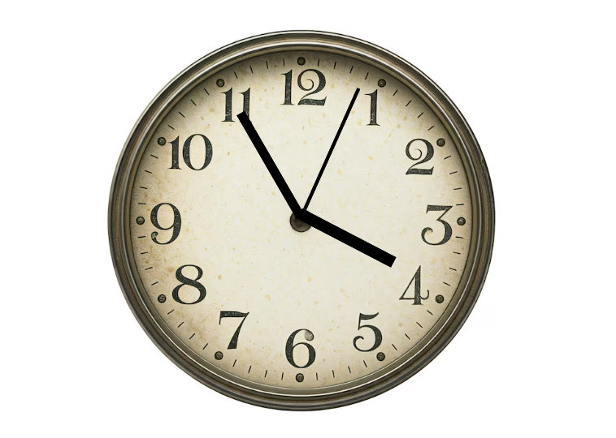

# Analog Clock

## Description

This is an Analog Clock developed using HTML, CSS and JavaScript. The project displays the current time by moving the hour, minute and second hands in real time. It uses JavaScript Date functions and CSS transforms to create a simple and responsive clock.

---

## Features

- Displays the current time
- Real time hour, minute and second hands
- Smooth clock hand rotation
- Responsive design
- Simple and easy to use interface

---

## Technologies Used

- HTML5
- CSS3
- JavaScript

---

## Screenshot

### Analog Clock

---

## Project Demo

Watch the project demo here:

[▶ Analog Clock Demo](Demo/Analog-Clock-Demo-Video.mp4)

---

## How to Run

1. Download or clone the repository.
2. Open the project folder.
3. Open the `index.html` file in your web browser.
4. The clock will automatically display the current time.

---

## Author

**Muhammad Talha**

Computer Science Student

---

## Thank You

Thank you for visiting this repository. I hope you find this project helpful.
